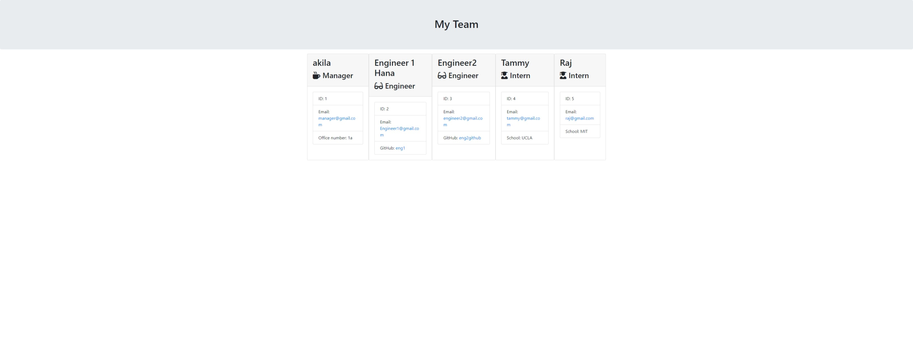

# Team Profile Generator Project  
   ## Description 
   The purpose of this project was to create a command line application using Node, to generate an html file with different roles based on the user input. I used classses as templates 
   for the object creation from the user inputs, the classes had to be run through tests using jest. 

   From this project I have further developed my skills in developing command line applications using node, using asynchronous code as well  as using jest for testing. 
   ## Table of contents 
   [Installation](#installation) 

   [Usage](#usage) 

   [Licence](#licence) 
   MIT

   [Contributions](#contributions) 

   [Tests](#tests) 
   All tests relating to the classes were passed using jest.js
   
   [Questions](#questions) 

   ## Installation 
   NA  
   ## Usage 
   
  Here is what the potential README will look like
    
   ## Licence 
   MIT  
   ## Contributions 
   NA 
   ## Tests 
   NA 
   ## Questions 
   if there is any questions please reach out to me at  
   Akila504 or dahaa001@hotmail.com